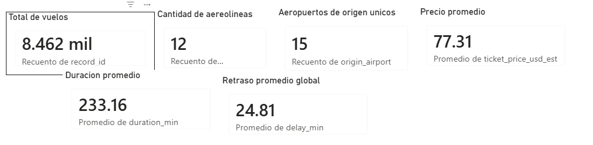
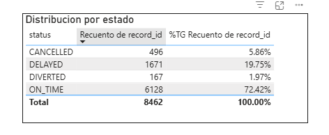
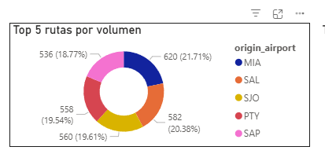
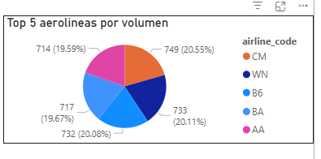

**Curso:** Seminario de sistemas 2

**Universidad:** Universidad de San Carlos de Guatemala (USAC) - FIUSAC 

**Estudiante:** Josue Daniel Solis Osorio

**Carnet:** 202001574

---

# Proyecto ETL - Dataset de Vuelos

## 1. Breve descripcion del dataset

Este proyecto procesa el archivo `dataset_vuelos_crudo.csv` para generar un dataset limpio en `dataset_vuelos_limpio.csv`.

El dataset contiene informacion operativa y comercial de vuelos, incluyendo:

- Aerolinea y numero de vuelo.
- Aeropuerto de origen y destino.
- Fechas de salida/llegada y duracion.
- Estado del vuelo (`ON_TIME`, `DELAYED`, `CANCELLED`, `DIVERTED`) y minutos de retraso.
- Datos del pasajero (ID, genero, edad, nacionalidad).
- Canal de venta, metodo de pago y precio estimado en USD.
- Equipaje total y documentado.

Cobertura temporal del dataset limpio:

- Fecha minima de salida: `2024-01-01 02:14:00`
- Fecha maxima de salida: `2025-12-31 15:59:00`
- Registros finales limpios: `8462`

## 2. Transformaciones realizadas (ETL)

El script `etl.py` aplica las siguientes transformaciones:

1. Extraccion:
- Carga del CSV original con todas las columnas en formato texto para controlar conversiones.

2. Limpieza y estandarizacion:
- Normalizacion de textos (trim + mayusculas).
- Homologacion de genero (`MASCULINO`/`MALE` -> `M`, `FEMENINO`/`FEMALE` -> `F`, otros -> `X`).
- Estandarizacion de estado de vuelo (`ON TIME`/`ONTIME` -> `ON_TIME`, etc.).
- Parseo robusto de fechas mixtas (`dd/mm/yyyy`, `mm-dd-yyyy hh:mm AM/PM`).
- Parseo robusto de numericos con distintos separadores decimales (`77,60`, `138.8`, `1.234,56`, `1,234.56`).

3. Validaciones de calidad:
- Filtrado de registros sin llaves esenciales (`passenger_id`, `flight_number`, `departure_datetime`, origen/destino, etc.).
- Validacion de codigos IATA (3 letras).
- Reglas de negocio:
  - `delay_min >= 0`
  - `duration_min >= 1`
  - `0 <= passenger_age <= 120`
  - `bags_checked <= bags_total`
  - `ticket_price_usd_est >= 0`

4. Deduplicacion:
- Eliminacion de duplicados por evento de vuelo usando clave de negocio:
  - `passenger_id + flight_number + departure_datetime + origin_airport + destination_airport`

5. Carga final:
- Escritura del resultado limpio en `dataset_vuelos_limpio.csv`.

## 3. KPIs del dashboard (calculados sobre `dataset_vuelos_limpio.csv`)

### KPIs principales

- Total de vuelos: `8462`
- Aerolineas unicas: `12`
- Aeropuertos de origen unicos: `15`
- Precio promedio (USD): `77.31`
- Duracion promedio (min): `233.16`
- Retraso promedio global (min): `24.81`

### Distribucion por estado

### Top 5 rutas por volumen

### Top 5 aerolineas por volumen

## 5. Interpretacion de los KPIs

- La operacion muestra buen desempeno puntual: `72.42%` de vuelos `ON_TIME`.
- Existe una bolsa relevante de riesgo operativo: casi `1` de cada `5` vuelos llega con retraso (`19.75%`), y cuando ocurre el retraso su severidad es alta (`125.66` min promedio).
- Las cancelaciones (`5.86%`) y desvio de ruta (`1.97%`) deben monitorearse como indicadores de estabilidad operativa.
- El precio promedio estimado (`USD 77.31`) sugiere una mezcla de rutas cortas y medias con posicionamiento de tarifa media.
- Las rutas con mayor volumen se concentran en conexiones de alta demanda regional (`MIA-HAV`, `HAV-BOG`, `HAV-CUN`).

